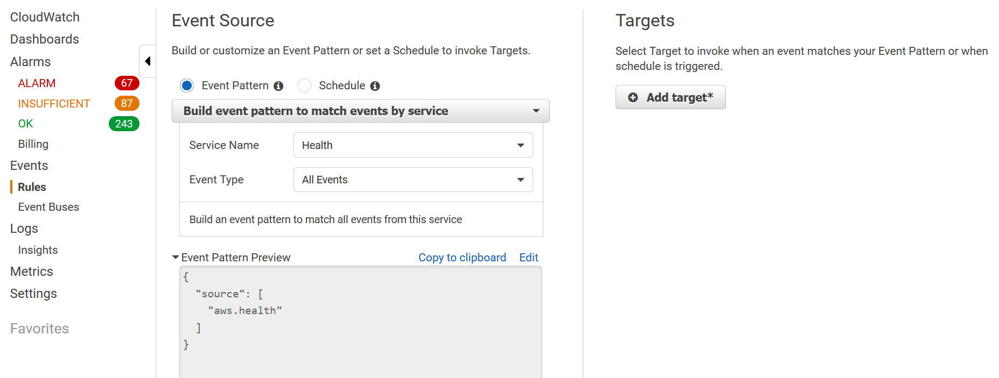
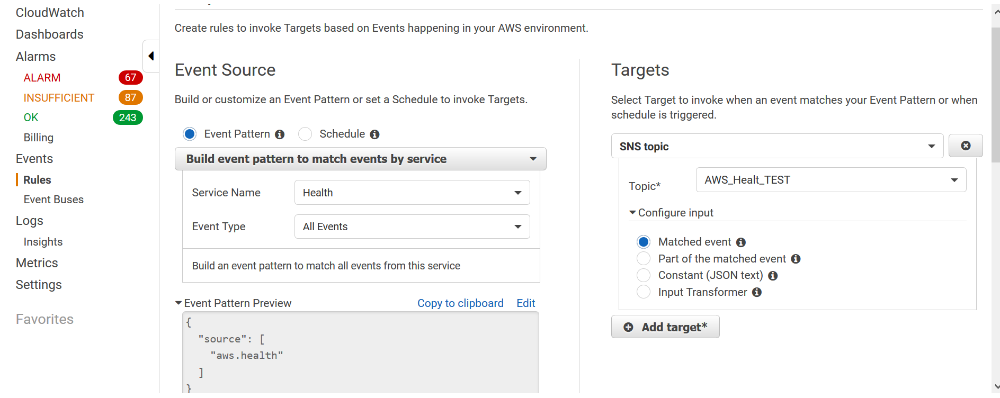
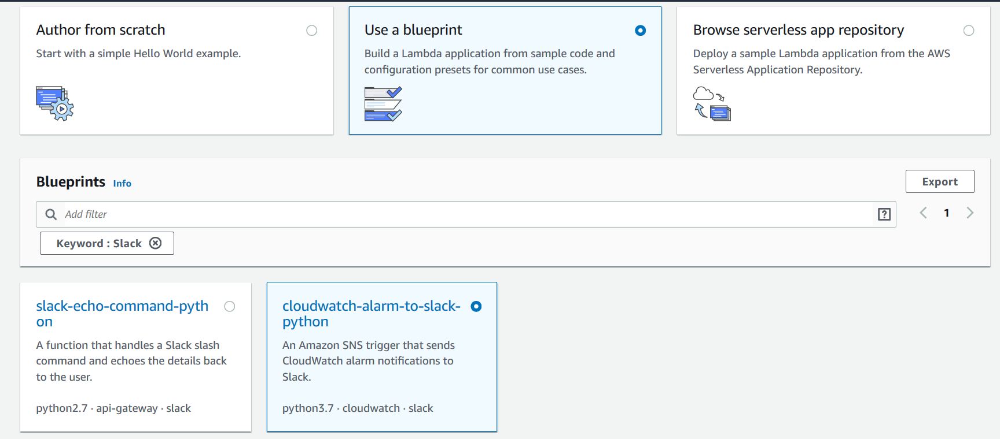

# AWSHealthSnsToLambda
Lambda function to send aws health SNS notifications to a slack channel

## Follow these steps to configure the webhook in Slack:

  * Navigate to https://<your-team-domain>.slack.com/services/new

  * Search for and select "Incoming WebHooks".

  * Choose the default channel where messages will be sent and click "Add Incoming WebHooks Integration".

  * Copy the webhook URL from the setup instructions and use it in the next section.

## Creating AWS Health alert using CloudWatch Events and SNS

  * In the AWS console go to Personal Health Dashboard
	
  * Click on 'Setup notifications with CloudWathc Events' on the upper right-hand corner. This will take you directly to create a CloudWatch Event

	

  * On the event select the `Service Name`, in this case is `Health`,  On `Event Type` select `All Events` unless you need to alert specific events

	

  * On the `Targets` section select `SNS Topic` as the target and input the topic you created on `Topic*`

	

## Creating the Lambda Function
 
 * in lamda you can simply select  `use a blueprint` and then search for slack, use the blurpint `clowdwatch-alarm-to-slack-python` and the just replace the code with the function in this repository

	
 * For the execution rule you can use the lambda basic execution role
 * On the SNS triger make sure to slect the correct SNS topic yo used when setting the CLoudWatch event. yo can either enabled the triger or leave it disable for testing the function first and enable the trigger later
	

### To encrypt your secrets use the following steps:

  * Create or use an existing KMS Key - http://docs.aws.amazon.com/kms/latest/developerguide/create-keys.html

  * Click the "Enable Encryption Helpers" checkbox

  * Paste <SLACK_CHANNEL> into the slackChannel environment variable

  Note: The Slack channel does not contain private info, so do NOT click encrypt

  * Paste <SLACK_HOOK_URL> into the kmsEncryptedHookUrl environment variable and click encrypt

  Note: You must exclude the protocol from the URL (e.g. "hooks.slack.com/services/abc123").

  * Give your function's role permission for the kms:Decrypt action.

     Example:
```
{
    "Version": "2012-10-17",
    "Statement": [
        {
            "Sid": "Stmt1443036478000",
            "Effect": "Allow",
            "Action": [
                "kms:Decrypt"
            ],
            "Resource": [
                "<your KMS key ARN>"
            ]
        }
    ]
}
```
